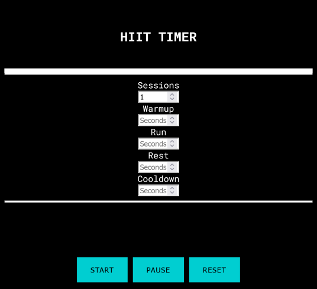
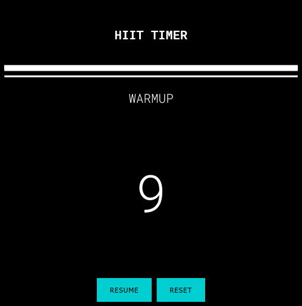
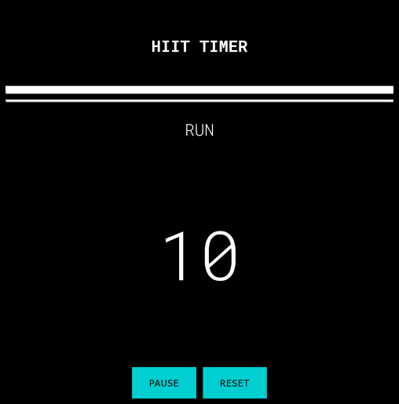
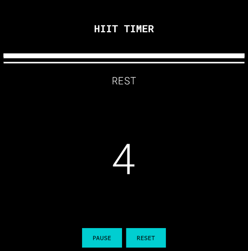
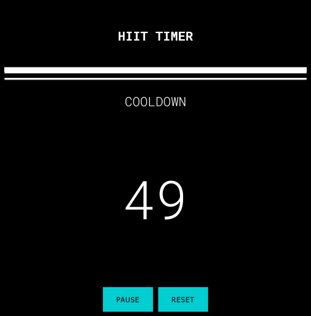
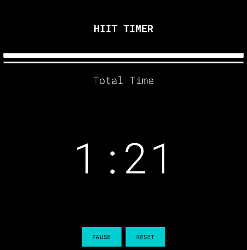

# hiit-it
A finished High-intensity Interval Training Timer hosted on the web.

The homepage should look like this.

Enter the number of sessions (run and rest periods), then the amount in seconds you wish to spend on your Warmup, Run, Rest, or Cooldown. Press start. You can pause the countdown or reset the inputs.

The warmup period begins and the clock ticks down to zero.
When you reach 10 seconds a voice starts counting down, and after reaching zero a bell is rung.

Run period begins.

Rest period begins.

Cooldown period begins.

At the end of the hiit workout the total time is displayed.

